# Project 1

## Overview

In this project we implemented mesh operations and bezier curves.

## Part 1

- For this part, we implemented de Casteljau's algorithm in an iterative approach, where our job as a student was to fill
out one level of the recursive form of the bezier curve. This evaluate step function simply does a lerp operation on
each line segment we are presented with and returns the outputs in a new vector.

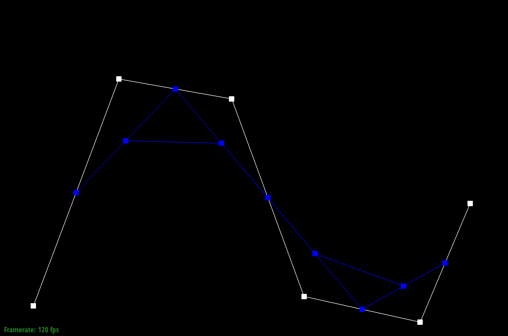
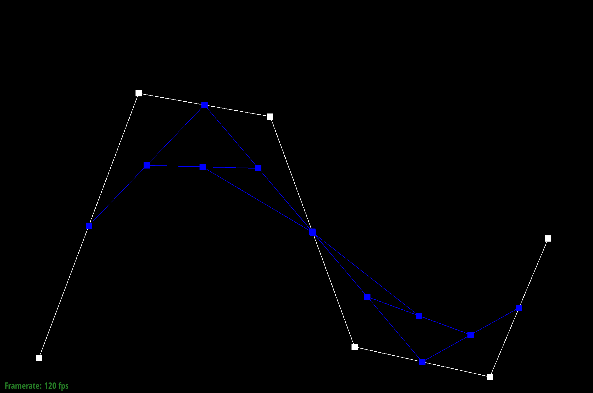
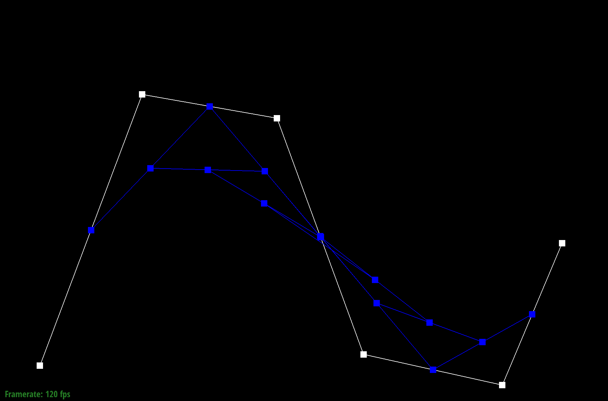
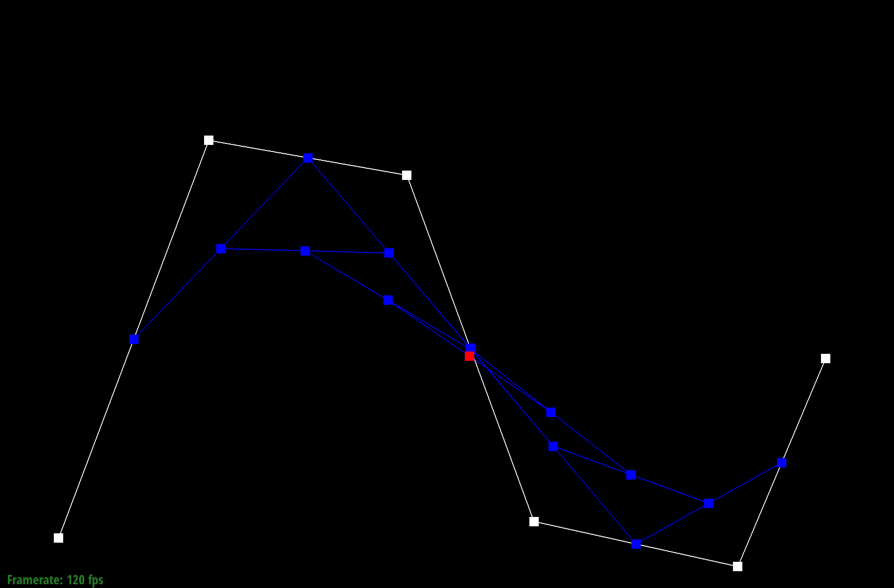

- Here is the curve after modifying t slightly

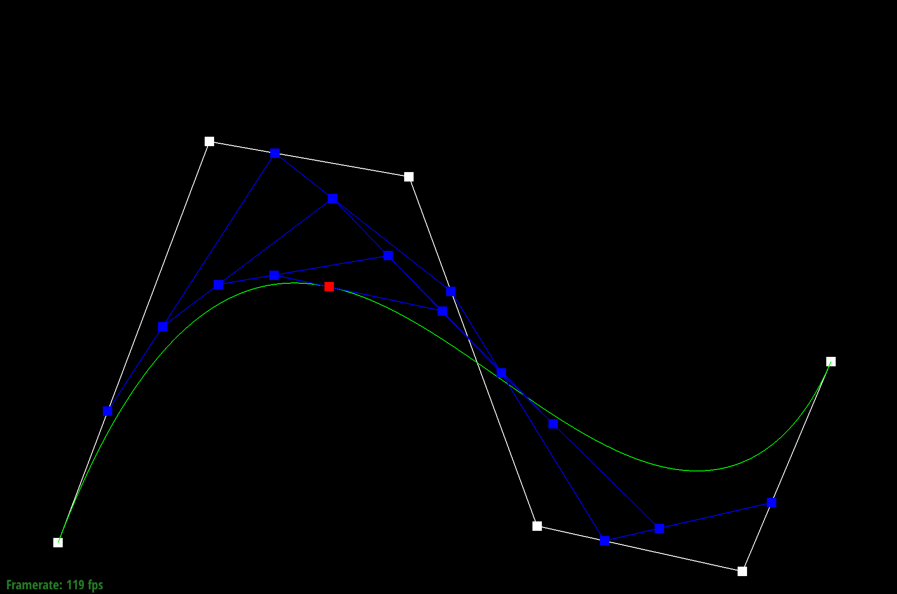

## Part 2

- Just like trilinear interpolation is just linear interpolation along the borders and then a linear interpolation perpendicuar based on the result of the previous linear interpolations, we do a bunch of horizontal bezier curve evaluations, and then use those results as control points to do a remaining bezier curve evaluation vertically to get the final result.

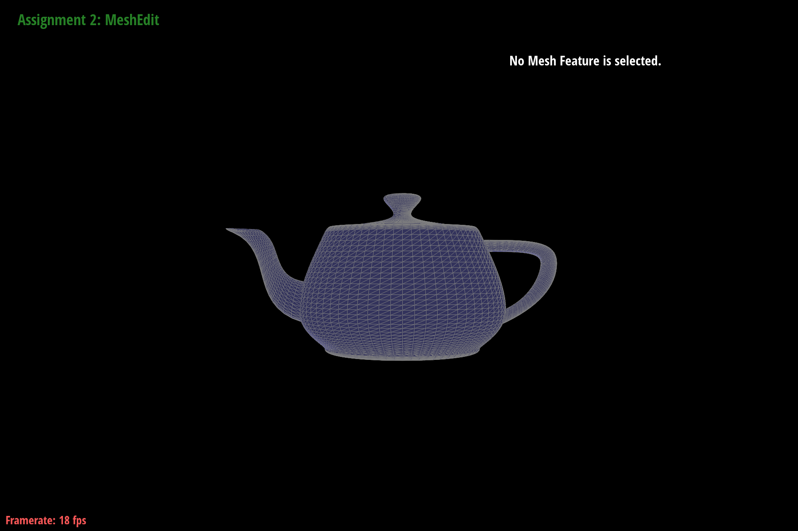

## Part 3

- For this part, we simply need to iterate over the adjacent faces of each vertex and average the normals of those faces to get the final normal for each vertex. To get the normal of a face, we take the cross product of the two vectors that make up the face (if you don't do the order right, then just return the negative of the mean normal later on). To get the next half edge for the next face, we can just do twin->next. We take the sum of all the adjacent normals and then normalize the vector.

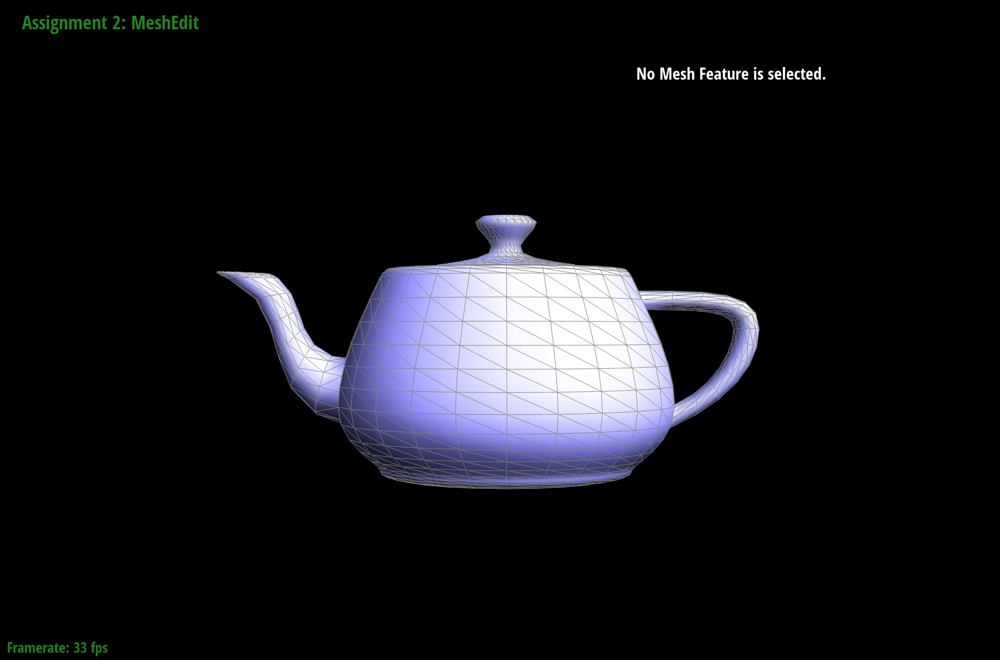
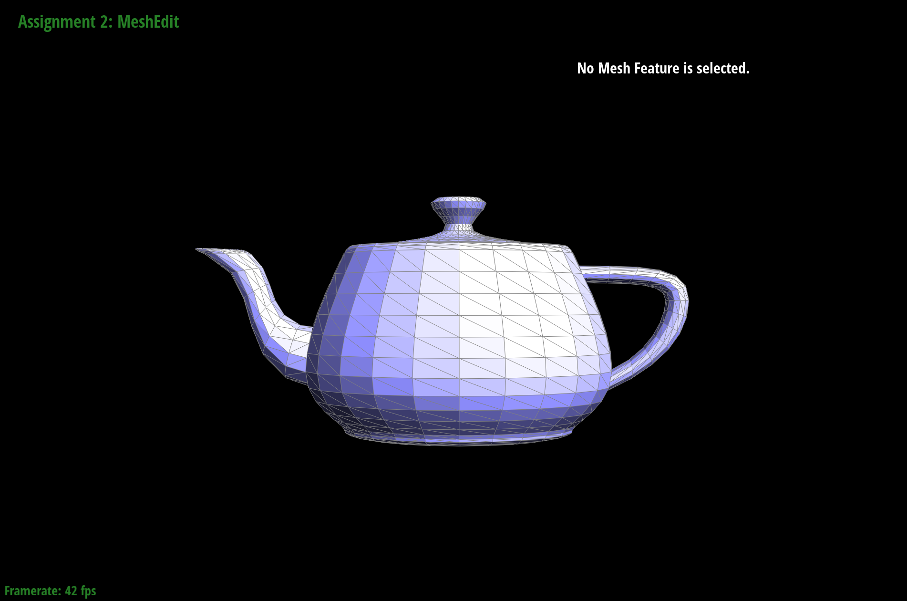

## Part 4

- For this part, I used the first of the two diagrams in http://15462.courses.cs.cmu.edu/fall2015content/misc/HalfedgeEdgeOpImplementationGuide.pdf to declare all my variables. I found that the renaming of all the half edges in the second diagram overcomplecated things and I just kept the halfedges at the same location while flipping. By keeping the names the same, it was just a matter of reassigning the halfedge next values (avoiding needing to reassign twins), and some of the faces to make sure that no faces were bound to halfedges that are now part of the new face.

- To debug, it was just a matter of having a lot of assert statements around, iterating through every halfedge and making sure that the next and twin values were correct in that they correctly led back to one another. Because I kept the names for each halfedge the same, I actually didn't have that many reassignments to do which was nice and it kept the debugging to a minimum... I think I only had one small bug where I'd forgotten to reassign a next() value to the halfedges that newly point to h0 and h3.

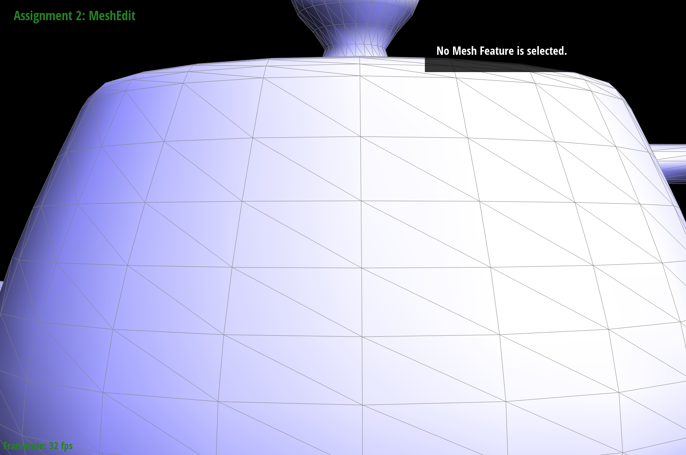
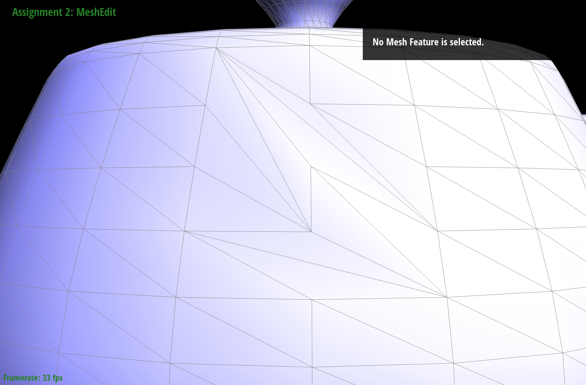

## Part 5

- For this part, I used the same diagrams as the last part to declare all of my variables. Once again, I kept all the destination names the same just for ease of use and minimal reassignments (that being said, there were still a lot). For every struct I created, I made sure to fill out all the fields and it helped that the names for all the old halfedges stayed the same, and I then just had to make sure that all the internally facing halfedges were assigned with the correct next() field and face field, since none of the old halfedges had edges or vertices or twins change.

- For debugging, I did the same thing with assert statements, but I think I had a touched by jesus miracle and it worked the first time I shit you not. I just went slowly and carefully vertex/halfedge/edge/face by vertex/halfedge/edge/face and made sure that everything that needed to be reassigned was reassigned. I tried to have good variable convention with the new half edges so I could tell which one was going towards the center or away from the center, and I think that saved me.

- Below on the right are splits and on the left are splits + flips.

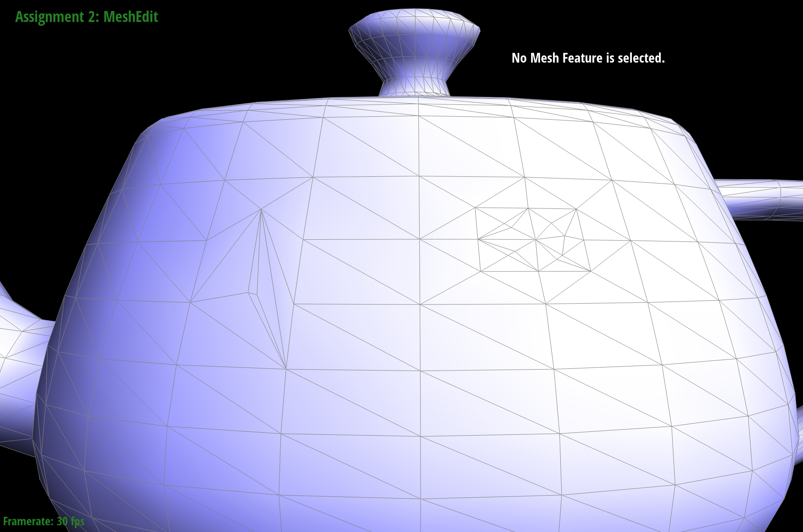

## Part 6

- For this, I went through and marked everything as old, then split (which will mark allocated vertices as true), following the spec flipped edges that are connected to an old vertex and a new vertex.  

- In general, sharp edges tend to be flattened out, as is seen with the cube. 

- For the following graphic, the cube is subdivided and the screenshot is from the same angle. We can see that as the cube is subdivided, the resulting subdivision is lumpy and uneven.

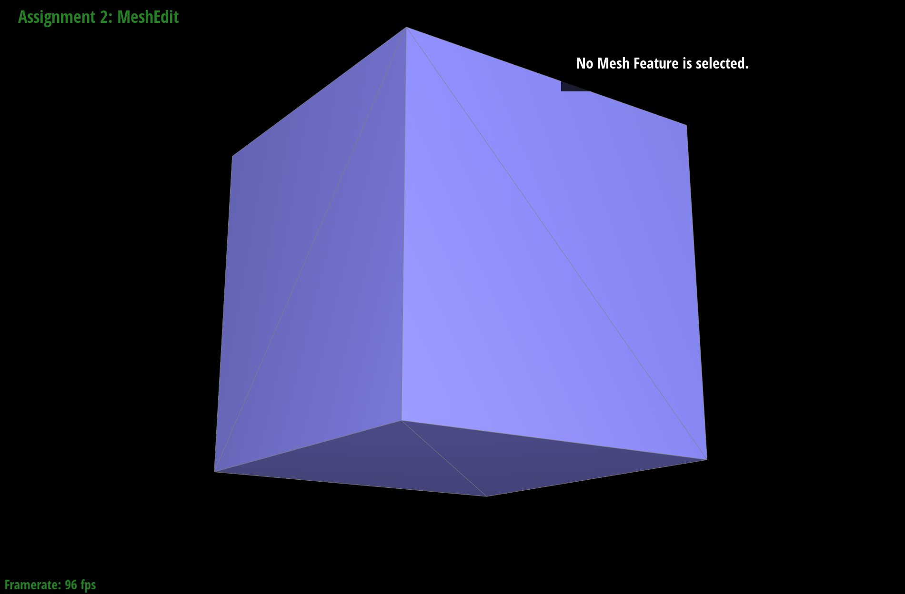
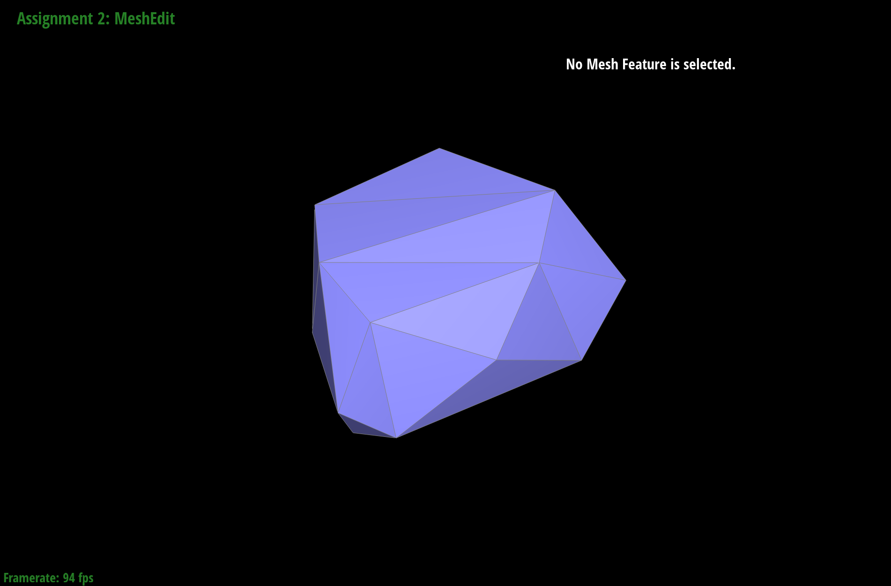
