# Project 3-1

In this project we are building a ray tracer. The ray tracer should be able to deal with multiple bounce lighting and faithfully reconstruct objects using monte carlo sampling to mimic the physical phenomena of light transport as it bounces and is modified along each bounce, intersecting with triangles and spheres and other objects along the way.

## Part 1
- For ray generation, we can simply apply the perspective projection equations. A small change in the image plane has a proportionally large change in the ray's xy coordinates (world space). Point xy in normalized image space is just the bilerp of the world xy coordinates defined at the edges and vice versa. 
- For triangle intersection, I first calculated the plane intersection with the plane of the triangle. I then calculated barycentric coordinates alpha beta gamma (making sure to check the sign on alpha and beta depending on the sign of the cross product we get when calculating the area), from which I check to see if any are negative, in which case we know that the point is not in the triangle. For spheres, I just used the formulas straight off lecture slides to calculate the point of intersection, checking to see if the square root is imaginary to verify intersection before continuing.
- Examples:

No sphere:

Lambertian Spheres:

Bunny:

## Part 2
- For my construction algorithm, I tried to split based on the axis with the largest variance in centroid values. I calculated the variance of each dimension, and split on the mean centroid value along that dimension. This worked well evidently. When constructing, after we've split using std::partition, we can just recurse on the left and right sides of the partition, creating new nodes for each side. If we have few enough elements for a leaf node, we just set the start and ends to be the start and end of our remaining primitives.
- Examples:

Lucy:

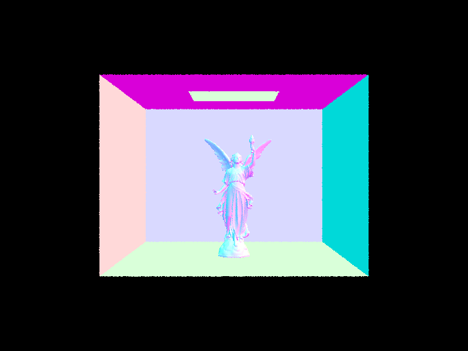

Cow

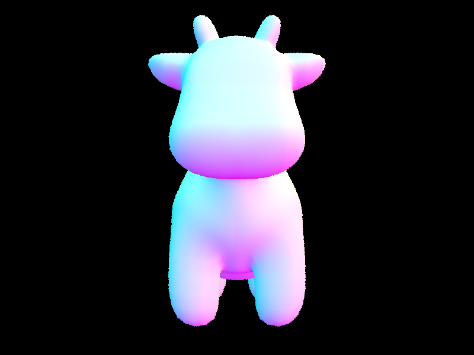

Dragon:

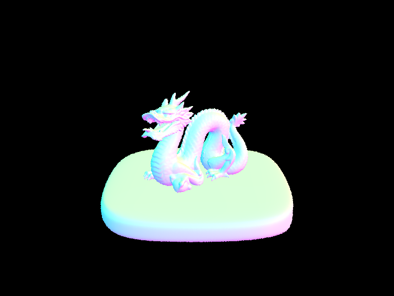

- Comparison: The BVH is much faster due to the increased efficiency. My implementation went from 30s for my laptop on the cow scene down to .03s. This is due to the fact that BVH runs in O(logn) time when it comes time to render, due to the fact that we are doing tree traversal instead of exhaustive search. This is seen in the fact that we do 3.49 intersection checks (not including bounding box intersection checks) on actual primitives compared to exhaustive search where we compare every ray with every primitive. This is a huge improvement in efficiency. All of these scenes are under one second to render out which is impressive considering I wasn't able to fully render out lucy at all before.
- Note: the pitfalls in this part were incredibly annoying... anything from inclusive vs exclusive inequality checks to short circuiting took away like 3 hours of my life I won't get back.

## Part 3

- Direct Lighting Hemisphere Implementation:
    - For this, we simply do monte carlo sampling on the hemisphere, and for each sample checking to see if it hit the light, and otherwise adding zero radiance. We simply use lambertian shading depending on the normal of the surface we are querying out from to determine how much radiance each sample adds. Uniform probability across this hemisphere for this part.
- Direct Lighting Importance Implementation:
    - For this, we use the same monte carlo sampling, but instead of sampling uniformly across the hemisphere, we only sample where there is light and then account for it in the monte carlo formula by plugging in this non-uniform probability (which re-weights everything correctly so our estimator is unbiased). For lights where we sample more than once (area lights instead of point lights), there needs to be a higher probability of being sampled or scaled down radiance to account for the fact that we sample these more than once.
- Direct Lighting Examples (w/o and w/ importance sampling respectively):

Bunny:

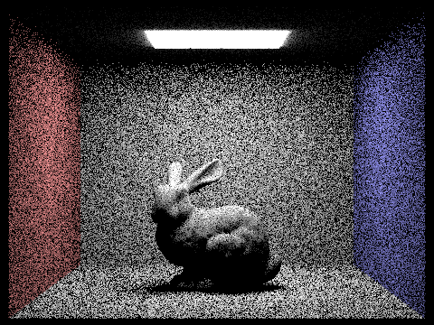

Spheres:

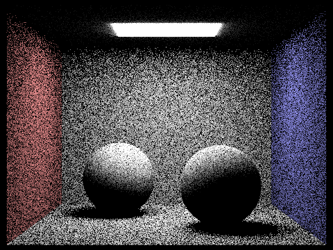

- You can see that most of the samples (even with 64 samples per ray) don't end up hitting a light, and are black, giving us a lot of black noise throughout the image. When we add importance sampling, every point has a much better chance of hitting a light.

- Varying number of samples per light <1, 4, 16, 64> (1 ray per pixel):

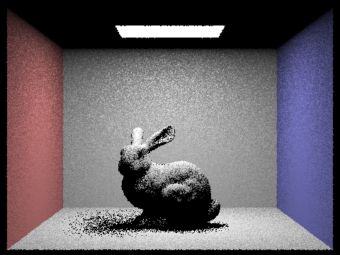

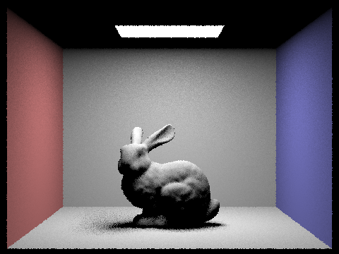

- You can see that we get less noise around the shadow of the bunny as we increase the number of samples of the area light. This is because the single bounce is probabilistically blocked by the bunny depending on which direction the ray bounces in the direction of the area light... certain directions are blocked by the bunny and certain directions are not. This is why as we increase the number of samples, we get less noise around the shadow.

- In general, doing the importance sampling is much better than not doing it. It is much more efficient to sample where there is light than to sample uniformly across the hemisphere. This is because we are more likely to hit a light source than not, and we can re-weight the samples to account for this. Most of our samples without importance sampling will be black, and this allows us to just skip that, and because its monte carlo estimations, we are still unbiased, meaning it's the same in expectation, but the results are lower variance.

## Part 4

- For indirect lighting, we just sample a new direction using f_sample, trace the ray and accumulate the radiance you get when you recurse on that new collision. At each step, we accumulate single bounce radiance, and black box the accumulated radiance along the rest of the ray and treat it the same as we would an incoming light source with one bounce. The formula is similar to the way it was with one bounce lighting since it's still lambertian shading.
- Examples with 1024 rays / pixel and 5 bounces:

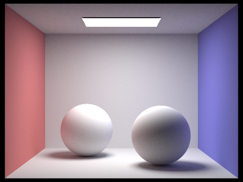

- Direct Lighting Only (still 1024 rays per pixel and 5 bounces...but really only the first bounce since it's only direct lighting):

- Indirect Lighting Only (still 1024 rays per pixel... 5 bounces still but basically excluding the first):

- Different max depths (still 1024 rays per pixel):

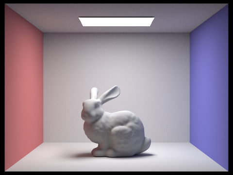

- Max depth does seem to help smooth out the lighting overall

- Different samples per pixel (still 5 bounces, now with 4 light rays instead of 16):

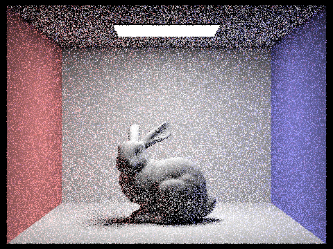

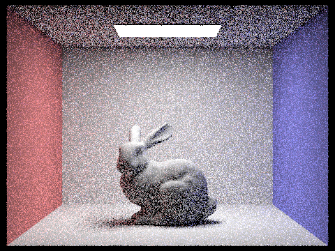

- Even with one sample per pixel it's not bad, a bit noisy but not bad overall. More samples per pixel does seem to help quite a bit though, and 1024 looks really crisp

## Part 5

- Adaptive sampling is when we decide to stop sampling for a pixel when the statistics we have collected so far indicate that there is a 95% chance that the computed mean is within some accepted percentage margin of error of the true mean, a margin of error we get from the value maxTolerance. For my implementation, I simply added a check inside my for loop that triggers every samplesPerBatch and checks this convergence condition, and if so, we terminate the for loop early and instead normalize our color by the number of samples we actually took. This worked and sped up the image significantly, even with twice the number of samples.

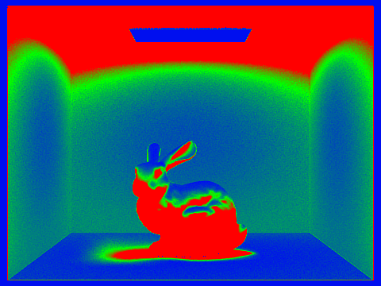

- As a note for this, my bunny looks a bit different from the spec, but staff on edstem said it was ok.