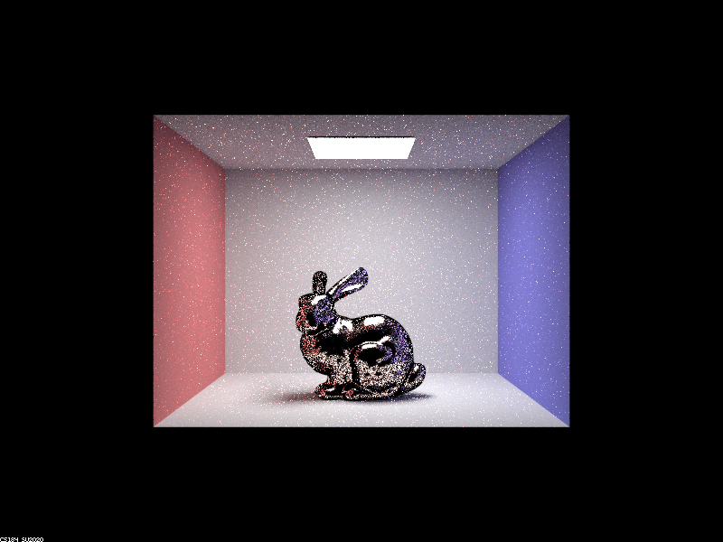

# Project 3-2

For this project, I did parts 2 and 4. In this part of the project, we implement the "everything else" for ray tracing. This is from reflections to refraction to environment maps. It basically enables us to render out a scene with anything in it. My choices were metals and field of view, since they looked straightforward in terms of implementation, and I'm generally interested in those two.

## Part 2

- Implementation: For this, I was able to mostly just follow the formulas out of the box. They were a little annoying to do and I'm not 110% comfortable with the derivation for the sampling method, I just understand that it's importance sampling and am black boxing it past that. The one area that was tricky was the black spot issue where I had to check my normals and make sure they were greater than zero before returning (hence the black spots, color was being subtracted from the ray as we accumulate).
- Dragon at .005, .05, .25, and .5 alpha values:

- These were rendered out with 256 samples per pixel and 4 samples per light (it was unclear whether the instructions meant at least 1 or just 1, so I went with the default of 4 in the command listed to render out the examples in part 2 spec) and 7 bounces.
- Clearly, as the value of alpha increases, the dragon becomes rougher and rougher. The lower the value of alpha, the more polished it appears to be.

- Below are 2 images of the bunny, the first with cosine sampling and the second with importance sampling. The bunny was rendered out with 256 samples per pixel and 1 samples per light and 7 bounces.

- You can see that there is a lot less black noise on the surface of the bunny with importance sampling which is nice. This is from the fact that all of our rays are actually being directed in directions that have higher reflected light values, so we're not wasting as many rays on areas that are dark like with cosine sampling.

- Copper dragon (eta: 0.27105  0.67693	1.31640,   k: 3.60920	2.62480	2.29210)

- You can see that it is much red (because copper is red) than the gold was.

## Part 4
- Differences: A theoretical pinhole camera with an infinitismally small hole is in theory perfect in that light has only one direction it can travel to enter the camera, resulting in crisp images, but in practice this is imperfect since if your pinhole is too small it won't capture light. Lenses are used because they can capture more light coming in a wider area and get close to a pinhole in terms of preserving this property that light coming in at a given angle to the lens is directed to exactly one place. Lenses are nice but imperfect and cause some of the artifacts that we see like objects being out of focus if the lens configuration isn't right. When we go to model this, the difference is that in a pinhole camera the rays came from a singular point, and now the rays need to come from a small disc where the camera's lens is, and the angles need to be adjusted ever so slightly so they point to the intersect of the pinhole's ray and the plane of focus, but originate from a sampled location on the lens.

- The following images are rendered out with focus distances of 4, 4.5, 5, and 5.5. All images are rendered with 512 samples per ray, ray depth of 12, 4 samples per light, and apeture of .23. 

- You can see that as the distance increases, the part of the dragon that is in focus changes to the further and further back parts of the dragon... this is because the plane of focus should be the part of the image that is most in focus, and we are progressively moving that plane back by increasing the distance until the plane of focus.

- Below is the apeture set to .1, .2, .3, and .4 respectively. All images are rendered with 512 samples per ray, ray depth of 12, 4 samples per light, and focus plane of 4.5.

- As you can see, the wider the apeture, the blurrier the out of focus parts are. This makes sense because, we have more light coming into the lens.