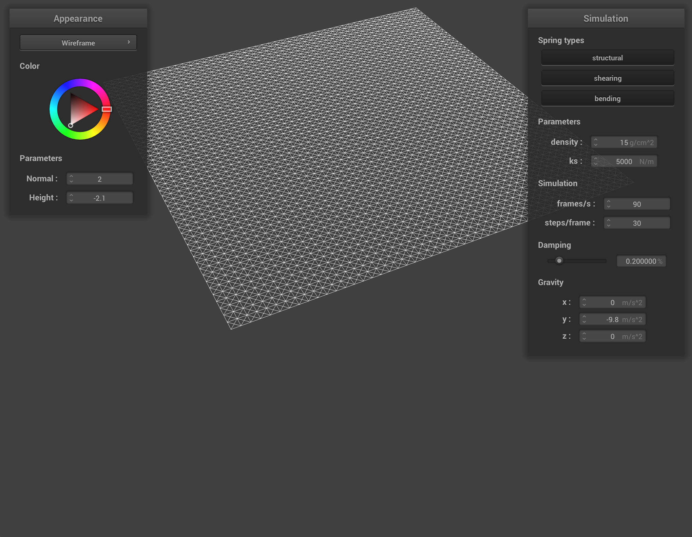

# Project 4

Overview: In this project, we will be creating a cloth simulator. We will be approximating physics with small discrete time steps to mimic a cloth with a mesh where each edge is one or more springs. We will step this system forward in time to approximate cloth falling and moving. We will do performance speedups and deal with self interaction and implement shaders in the end.

## Part 1: Masses and Springs

Overview: Here we add 3 physics constraints: structural, bending, and shearing. We represent these with 3 springs per point (excluding edges which are different), each of which imposes different constraints on the system.

No shearing:

Only shearing:

All constraints:

## Part 2: Simulation via numerical integration

Overview: Here we will actually do some of the approximation of continuous time physics. We will use the Verlet integration scheme to step the system forward in time. We will also add some damping to the system to make it more stable.

Here is the system before we start messing with things:

I noticed that the higher the spring constant K, the higher the bump in the cloth would be, with the diagonal lines coming closer and closer to the horizontal.

I noticed that the higher the density, the lower the cloth would hang, the opposite effect of raising the spring constant K

The dampening caused the cloth lower down in a much longer and drawn out fashion, as if it was encountering air resistance.

## Part 3: Collisions with Other Objects

Overview: Here we will add collisions with other objects. We will do this by adding a collision constraint between the cloth and a sphere. We will also add a collision constraint between the cloth and a plane. A collision constraint simply looks at whether a point crossed a boundary after the last time step.

Here is the system reset with k=5000, k=500, and k=50000, respectively:

You can clearly see that the spring constant rising enforces stronger structural constraints, and the higher the spring constant, the stiffer the cloth appears, with fewer and longer bends and raising itself out from the sides.

Here is the system on a plane. I found that it flickered a tiny bit, but edstem seemed to indicate that this is ok behaviour.

## Part 4: Handling self-collisions

Here, we will need to avoid self collisions by searching every time step to make sure no point gets too close to another point on the cloth, moving them to avoid this case. We will do this quickly with spatial hashing at each time step of the points on the mesh, avoiding an O(n^2) function.

Here are screenshots of the cloth as it goes on in time.

You can see that it folds instead of going through itself.

Increasing the density causes the folds to be closer together and unfortunatley did cause a tiny bit of phasing through itself early on, though as time went on it righted itself. This is expected since the cloth is now heavier, and you would expect it to collapse in on itself more, defying the structural constraints.

In increasing the spring constant, we make the cloth more rigid, so the folds are farther apart as it falls.

## Part 5: Shaders

Here we implement shaders with the cloth. This actually surprisingly easy, and I was able to get it working in around an hour... I got really lucky on the syntax and in making assumptions about the vectors (couldn't really find good explanations of why we chose to use homogeneous coords for some vectors and 3dim vectors for others)

Explanation of shader: a shader is a program that is run for each vertex to determine the position (vert) and each time we paint a face to determine the color (frag). These are the vert and frag programs. It's nice that these small programs can run independently, making it easy to massively parallelize these operations.

Phong shading (specular, diffuse, ambient, everything):

Custom texture:

Bump:

Displacement:

Coarseness (16, then 128):

You can see that the finer the mesh, the less the displacements seem to matter

Reflection:

